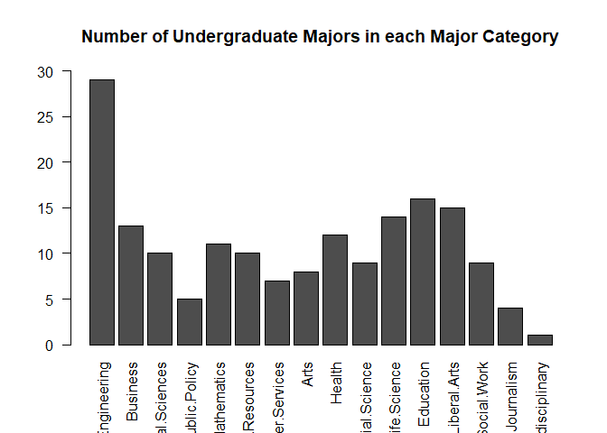

## 1: *FiveThirtyEight* Data Gathering
#### A. Install and load *fivethirtyeight* package

```r
# Install package
# Previously run: install.packages('fivethirtyeight')
# Load package for use in current session
library(fivethirtyeight)
```

#### B. Assign 18th data set to variable *df*

```r
# Find 18th data set
data(package="fivethirtyeight")$results[18,]
```

```
##                                                Package 
##                                      "fivethirtyeight" 
##                                                LibPath 
## "C:/Users/Dana Geislinger/Documents/R/win-library/3.4" 
##                                                   Item 
##                                 "college_recent_grads" 
##                                                  Title 
##        "The Economic Guide To Picking A College Major"
```

```r
# Assign 18th data set name to variable 'df'
df <- fivethirtyeight::college_recent_grads
```

#### C. Write the URL of the story related to *df* in a comment

```r
# Print more detailed list of the 'fivethirtyeight' data sets
vignette("fivethirtyeight", package="fivethirtyeight")
```

```
## starting httpd help server ... done
```

```r
# URL found on vignette webpage
# http://fivethirtyeight.com/features/the-economic-guide-to-picking-a-college-major/
```

#### D. Print dimensions and column names of data.frame *df*

```r
# Print 'df' dimensions
cat(paste("Rows:",
          dim(df)[1],
          "\nColumns:",
          dim(df)[2],
          sep="\t")
    )
```

```
## Rows:	173	
## Columns:	21
```

```r
# Print 'df' column names
names(df)
```

```
##  [1] "rank"                        "major_code"                 
##  [3] "major"                       "major_category"             
##  [5] "total"                       "sample_size"                
##  [7] "men"                         "women"                      
##  [9] "sharewomen"                  "employed"                   
## [11] "employed_fulltime"           "employed_parttime"          
## [13] "employed_fulltime_yearround" "unemployed"                 
## [15] "unemployment_rate"           "p25th"                      
## [17] "median"                      "p75th"                      
## [19] "college_jobs"                "non_college_jobs"           
## [21] "low_wage_jobs"
```

## 2: *FiveThirtyEight* Data Analysis
#### A. Write R commands to get *df* column names and number

```r
# Function to get column names of a data.frame
df.col.names <- function(df) {names(df)}
df.col.names(df)
```

```
##  [1] "rank"                        "major_code"                 
##  [3] "major"                       "major_category"             
##  [5] "total"                       "sample_size"                
##  [7] "men"                         "women"                      
##  [9] "sharewomen"                  "employed"                   
## [11] "employed_fulltime"           "employed_parttime"          
## [13] "employed_fulltime_yearround" "unemployed"                 
## [15] "unemployment_rate"           "p25th"                      
## [17] "median"                      "p75th"                      
## [19] "college_jobs"                "non_college_jobs"           
## [21] "low_wage_jobs"
```

```r
# Function to get number of columns in a data.frame
df.col.number <- function(df) {dim(df)[2]}
df.col.number(df)
```

```
## [1] 21
```

#### B. Count occurences of each *major_category* in *df*

```r
# Generate vector of all unique values in 'major_category' column
unique.categories <- unique(df$major_category)

# Create an empty list to store counts for each major category
category.counts <- list()

# Loop through all major categories
for (category in unique.categories) {
  # Create vector filled with all occurences of 'category' in 'major_category' column of 'df'
  category.occurences <- df$major_category[df$major_category == category]
  # Store the length of that vector in the 'category.counts' list under the correct category name
  category.counts[[category]] <- length(category.occurences)
}

# Convert 'category.counts' to data.frame object and store in new variable 'major_count'
major_count <- data.frame(category.counts, row.names = "Count")
```

#### C. Create barplot for *major_count*

```r
# Make text appear perpendicular to axis in barplot
par(las=2)

# Create barplot of 'major_count'
#   as.matrix(major_count): convert data.frame object to matrix
#     Allows barplot to use data for 'height'
#   main: title of barplot
#   ylim: vector containing minimum/maximum y-axis values
barplot(as.matrix(major_count),
        main="Number of Undergraduate Majors in each Major Category",
        ylim=c(0, 30)
        )
```

<!-- -->

#### D. Write *df* to csv file without row labels

```r
# Save 'df' data.frame to csv file named 'five_thirty_eight.csv' in current working directory
#   file: name of file to save data to
#   row.names: whether ot not to tell R to save csv file with row labels
write.csv(df,
          file="five_thirty_eight.csv",
          row.names=FALSE
          )
```

## 3. Create MSDS Homework GitHub Repository
#### D. Link to GitHub Repository: https://github.com/danageis/SMU-MSDS-Homework.git
